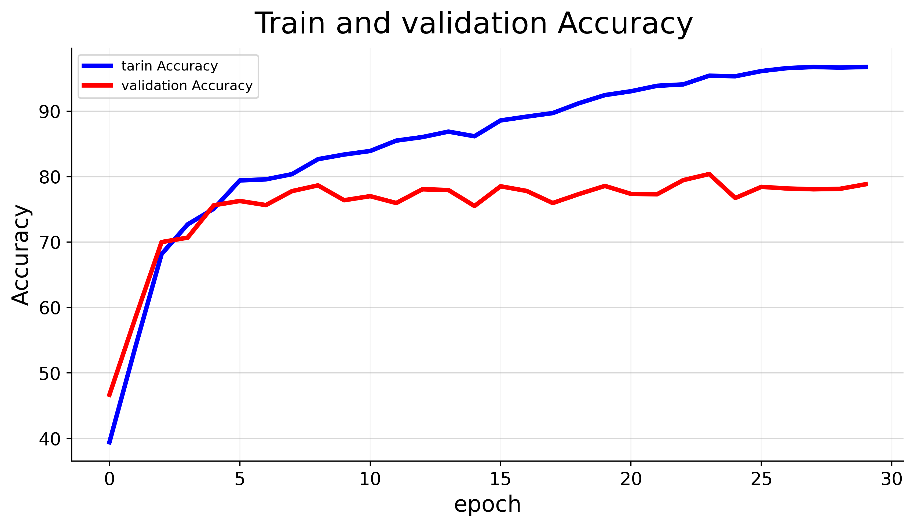
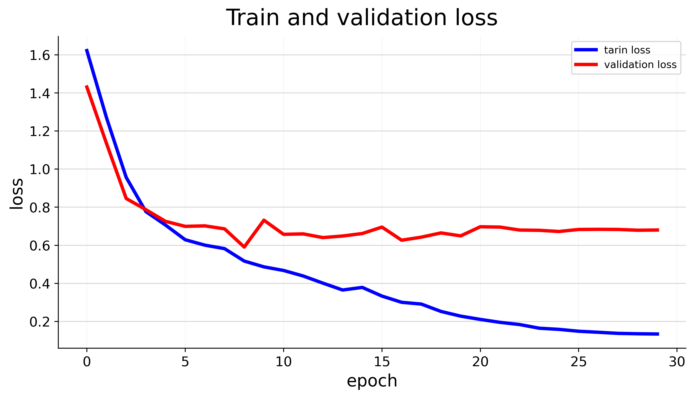

# Huber-Emotion_Detection


## Project Description

Huber-Emotion_Detection is a project that utilizes the Hugging Face Transformers library to perform audio emotion detection. The main objective of this project is to classify audio emotions into six different categories using the "facebook/hubert-base-ls960" model. The dataset used for training and evaluation is the [Shemo Persian Speech Emotion Detection Database](https://www.kaggle.com/datasets/mansourehk/shemo-persian-speech-emotion-detection-database).

## Installation

Make sure you have Python installed, then install the required packages using the following command:

```bash
pip install transformers
pip install librosa
```

## Usage

1. Clone the repository:

```bash
git clone https://github.com/your-username/Huber-Emotion_Detection.git
cd Huber-Emotion_Detection
```

2. Download the dataset from [here](https://www.kaggle.com/datasets/mansourehk/shemo-persian-speech-emotion-detection-database) and place it in the appropriate directory ('dataset/archive/').

3. Run the scripts to preprocess the data and train the model:

```bash
python train.py
```

4. Use the trained model for emotion detection:


# Demo
```python
# Load the trained model
import  torch
import  torch.nn        as      nn
from    transformers    import  AutoConfig, AutoTokenizer, AutoModel
from    transformers    import  Wav2Vec2FeatureExtractor

device = "cuda" 
embedding  = Wav2Vec2FeatureExtractor.from_pretrained('facebook/wav2vec2-base-960h')
model_name  = "facebook/hubert-base-ls960"
# Downlaoding ~350 Mb
HuBERT      = AutoModel.from_pretrained(model_name,output_hidden_states= True).to(device)     

classifier = nn.Sequential(nn.Dropout(0.5),
                            nn.Linear(768,128),
                            nn.ReLU(),
                            nn.Linear(128,6)).to(device)  
# Load an audio file and convert it to text
audio_text = "..."
audio_text = torch.rand(size=[1000,1000],device=device)

# Perform emotion classification
with torch.no_grad():
    outputs = embedding(audio_text,sampling_rate=16000, return_tensors='pt').input_values.to(device)        
    outputs = HuBERT(outputs.squeeze(0))
    outputs = outputs.last_hidden_state.mean(dim=1)   
    outputs = classifier(outputs)    
    print(outputs)
```

## Training Plots

<p float="center">
  
   
</p>
<p align="center" width="100%">
     
</p>

## Contribution Guidelines

Contributions to the project are welcome! If you want to contribute, please follow these steps:

1. Fork the repository.
2. Create a new branch for your feature or bug fix.
3. Make your changes and commit them.
4. Push your changes to your fork.
5. Open a pull request, describing the changes you've made.

